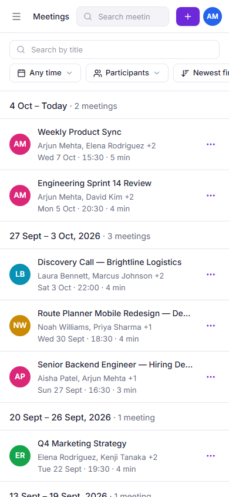
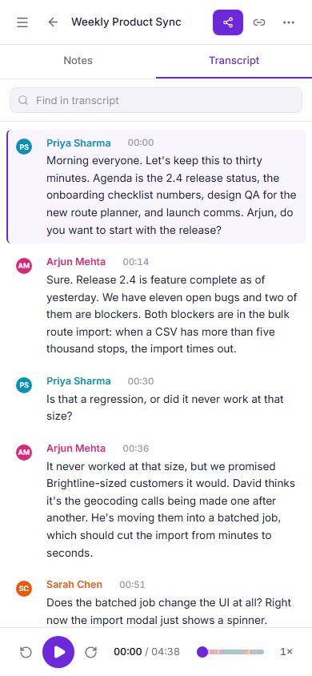
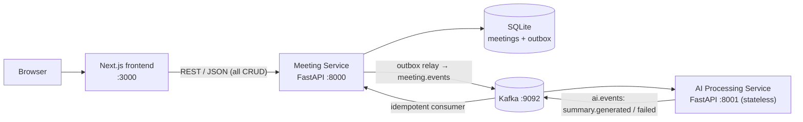
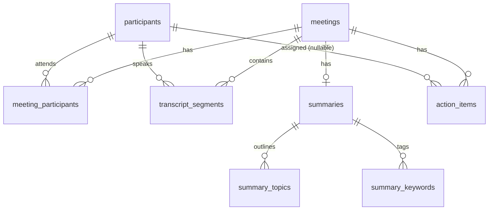

# Lumen: a Fireflies.ai-style meeting notes workspace

Lumen is a meeting library and post-meeting workspace modelled on Fireflies.ai, built for the Scaler SDE Fullstack
assignment. You browse your meetings, open one to read a speaker-labelled transcript synced to a player, and review
AI notes (summary, outline, keywords and action items) that a separate AI service generates asynchronously over
Kafka.

> **Status:** every must-have requirement in the brief is implemented and covered by automated tests (backend, a real
> Kafka broker and browser end-to-end).
> **Not done yet:** the GitHub repository isn't public, GitHub Actions has not run, and there is **no hosted demo**.
> Both are waiting on the author (see [Deployment](#deployment)).
> The strict self-assessment is in [FINAL_EVALUATION_REPORT.md](FINAL_EVALUATION_REPORT.md).

**Contents:** [Overview](#overview) · [Screenshots](#screenshots) · [Features](#features) · [Tech stack](#tech-stack) ·
[Architecture](#architecture) · [Repository](#repository-structure) · [Quick start](#quick-start) ·
[Configuration](#configuration) · [Seed data](#seed-data) · [Database](#database-schema) · [API](#api-overview) ·
[Testing](#testing) · [CI](#ci) · [Deployment](#deployment) · [Troubleshooting](#troubleshooting) ·
[Decisions](#design-decisions-assumptions-and-limitations) · [Documentation](#documentation)

## Overview

**Problem.** Fireflies records meetings and turns them into searchable transcripts and notes. The brief asks for that
post-meeting experience without real speech-to-text: a library of meetings, an interactive transcript, AI notes and
full CRUD, all looking and feeling like Fireflies.

**Solution.**
- **Next.js frontend:** the meetings library (the Fireflies home view) and the meeting workspace. Notes and
  transcript sit side by side, with a docked player that keeps the two in sync.
- **Meeting Service** (FastAPI + SQLite): the system of record. All REST traffic goes here.
- **AI Processing Service** (FastAPI): a stateless worker that turns a transcript into notes.
- **How they connect:** creating or editing a transcript writes the meeting *and* an event to a transactional outbox
  in one commit. The event travels through Kafka to the AI service, and the result comes back the same way and is
  applied idempotently. CRUD never goes through Kafka.

There is **no login**. As the brief allows, you are always the default demo user, *Alex Morgan*, and `/` opens the
meetings library directly.

## Screenshots

Captured from the running production build with the seeded data.

| Meetings library (home view): weekly groups, aligned columns | Meeting workspace: notes (≈73 %), transcript, player synced to the active line |
|---|---|
|  |  |
| **Search inside the transcript, with highlighted matches** | **New meeting: upload, paste or manual entry** |
|  |  |
| **Filters: last 30 days, one participant** | **Tablet width (1024 px)** |
|  |  |
| **Dark theme: library** | **Dark theme: meeting workspace** |
|  |  |
| **Phones: library and meeting (390 px)** | **Settings → Appearance (Light is the default)** |
|   |  |

## Features

### Implemented

| Area | What you can do |
|------|-----------------|
| **Meetings library** | Table of meetings grouped by week ("Oct 4 – Today · 3 meetings") with Meeting / Date / Time / Duration columns, participants, open action items and tag chips. Title search, date presets and custom range, participant filter, newest/oldest sort, tag filter (all kept in the URL). Details popover, row menu, multi-select with bulk delete |
| **Meeting workspace** | One-line toolbar (breadcrumb, purple Share, copy link, ⋯). AI notes as the main column (keywords, overview, timestamped outline, action items by assignee, talk time). Compact transcript column. Either panel can be expanded |
| **Transcript ⇄ player** | Click a line, chapter or action-item time and the player seeks there and plays. Playback or dragging the seek bar highlights and scrolls to the active line. Find-in-transcript with highlights, an n / m counter and ↑ / ↓. Keyboard: Space, ← / →, `/` |
| **CRUD** | Create a meeting by uploading `.txt` / `.vtt` / `.json`, pasting, or a manual form. Edit the title, date and participants. Delete. Add, edit, complete, uncomplete and delete action items. Everything persists in SQLite |
| **Asynchronous AI notes** | A new meeting returns immediately and shows "Generating notes…". Notes arrive through Kafka and the page updates itself with a toast. Failures show the reason and a Retry button |
| **Fireflies experience** | Icon rail + contextual Meetings sidebar, compact toolbars, dialogs, popovers, toasts on every action, loading / empty / error states, responsive down to 390 px, Lumen favicon |
| **Bonus features** | Global search across meetings (deep-links to the moment) · tags from AI keywords · export of the transcript or notes as TXT / Markdown · theme: Light by default, plus Dark and System ([details](docs/BONUS_FEATURES.md)) |

### Intentionally mocked or out of scope (as the brief allows)

| Not implemented | What you see instead |
|-----------------|----------------------|
| Authentication | A fixed demo user; "Sign out" explains that sign-in is out of scope |
| Real speech-to-text and audio/video | Transcripts are seeded, uploaded or pasted. The player runs a simulated playback clock (its info icon says so) |
| LLM summaries | A deterministic mock provider (heuristics over the transcript) behind a `SummaryProvider` interface ([ADR-007](docs/adr/007-mock-summary-provider.md)) |
| Live meeting bot, integrations, team sharing, channels, notifications | "Coming soon" dialogs |
| Bonus comments/soundbites and "Ask a question" chat | Deliberately deferred ([reasons](docs/BONUS_FEATURES.md)) |

## Tech stack

| Layer | Choice |
|-------|--------|
| Frontend | Next.js 16 (App Router) · React 19 · TypeScript (strict) · Tailwind CSS v4 · Radix UI · TanStack Query · lucide-react · sonner |
| Meeting Service | Python 3.11 · FastAPI · SQLAlchemy 2.1 · Alembic · Pydantic v2 · aiokafka |
| AI Processing Service | Python 3.11 · FastAPI · aiokafka · pluggable `SummaryProvider` (mock) |
| Database | SQLite (WAL, foreign keys enforced) |
| Messaging | Apache Kafka 3.9 (single-node KRaft, Docker) |
| Testing | pytest · pytest-cov · pytest-asyncio · Vitest · Playwright |
| Tooling | ruff · mypy (strict) · ESLint · Prettier · Docker Compose · GitHub Actions |

Each choice is justified in an [ADR](docs/adr/).

## Architecture



- **Two services, one seam.** The Meeting Service owns all data. The AI service has no database and receives the
  whole transcript in the event ([ADR-004](docs/adr/004-two-service-architecture.md)).
- **Reliable events.** The meeting and its outbox row commit together. A relay publishes them with backoff, and a
  consumer commits offsets after the database commit ([ADR-008](docs/adr/008-transactional-outbox.md)).
- **Idempotency.** Duplicate deliveries and stale results are recognised and ignored
  ([docs/EVENT_DRIVEN_ARCHITECTURE.md](docs/EVENT_DRIVEN_ARCHITECTURE.md)).
- **Status is visible.** `processing_status` moves through `not_requested → pending → processing → completed |
  failed`; the UI polls only while work is in flight.
- **No-broker fallback.** `PROCESSING_MODE=http` reuses the same envelope and handlers for hosts without Kafka.

Full detail: [docs/ARCHITECTURE.md](docs/ARCHITECTURE.md).

## Repository structure

```
backend/
  meeting-service/        FastAPI system of record
    app/                  routers → services → repositories → models; schemas; events/ (outbox relay, consumer); seed/
    alembic/              migrations           samples/   example .txt / .vtt / .json transcripts
    tests/                unit · integration · kafka (real broker) · contract
  ai-service/             stateless worker: providers (mock), processor (retries), Kafka consumer, HTTP fallback
frontend/
  app/                    routes: / (→ /meetings), /meetings, /meetings/[id], /settings; icon.svg
  components/             layout · meetings · workspace · transcript · audio · summary · action-items · settings · ui
  hooks/ · lib/           TanStack Query hooks; API client, playback clock, transcript sync and search, filters, theme
  tests/e2e/              Playwright specs (run against the real services)
deploy/                   production stack: Caddy + frontend + both services + Kafka (docker-compose.prod.yml)
docs/                     architecture, schema, API, events, testing, ADRs, guides, audits
docker-compose.yml        local Kafka + both backend services
.github/workflows/ci.yml  CI pipeline
```

## Quick start

**Prerequisites** (versions used and tested):

| Tool | Version | Needed for |
|------|---------|------------|
| Git | any recent | cloning |
| Python | 3.11 (`requires-python >= 3.11`) | both backend services and their tests; Playwright starts them |
| Node.js | 22 or newer (`engines: >= 22`) | frontend |
| Docker Desktop (Compose v2) | any recent | Kafka (Options A and B), real-Kafka tests, the production stack |

Commands use bash (Git Bash on Windows). In PowerShell, activate a virtual environment with `.venv\Scripts\Activate.ps1`
and use `copy` instead of `cp`. SQLite needs no installation: the Meeting Service creates and migrates its database
file on first start.

**Option A: backend in Docker, frontend native** (closest to the real architecture)
```bash
git clone <repo-url> fireflies-clone && cd fireflies-clone
docker compose up -d --build --wait     # Kafka + meeting-service :8000 (seeds itself) + ai-service :8001
cd frontend && npm install && cp .env.example .env.local && npm run dev   # http://localhost:3000
```

**Option B: services native, Kafka in Docker**
```bash
docker compose up -d --wait kafka       # broker on localhost:9092

# Terminal 1: Meeting Service
cd backend/meeting-service
python -m venv .venv && source .venv/Scripts/activate      # macOS/Linux: source .venv/bin/activate
pip install -r requirements-dev.txt && cp .env.example .env
python -m app.seed                                          # migrate + load the 7 demo meetings
uvicorn app.main:create_app --factory --reload --port 8000

# Terminal 2: AI Processing Service
cd backend/ai-service
python -m venv .venv && source .venv/Scripts/activate
pip install -r requirements-dev.txt && cp .env.example .env
uvicorn app.main:create_app --factory --reload --port 8001

# Terminal 3: frontend
cd frontend && npm install && cp .env.example .env.local && npm run dev
```

**Option C: no Docker (HTTP fallback, no Kafka).** Follow Option B without the `docker compose` line, after setting
the same mode and token in both service `.env` files:
```bash
# backend/meeting-service/.env and backend/ai-service/.env
PROCESSING_MODE=http
INTERNAL_API_TOKEN=change-me-to-a-long-random-string    # identical in both files
```
`inline-test` mode is for automated tests only: it processes nothing.

Options B and C were verified from a fresh clone: environments installed, seeding worked, health and `/docs`
responded, a new meeting completed, and `/` redirected to `/meetings`. Option A uses the same compose file as the
real-Kafka tests.

**Local URLs**

| What | URL |
|------|-----|
| App (opens the library) | http://localhost:3000 |
| Meeting Service API docs (Swagger) | http://localhost:8000/docs |
| Meeting Service health | http://localhost:8000/health (liveness) · http://localhost:8000/health/ready (database) |
| AI Service health | http://localhost:8001/health |
| Kafka | `localhost:9092` |

## Configuration

Each deployable reads its own environment. Every variable is documented in its `.env.example`, and real `.env`
files are git-ignored. **No API keys or secrets are needed.**

| File | Key variables |
|------|---------------|
| [backend/meeting-service/.env.example](backend/meeting-service/.env.example) | `DATABASE_URL`, `CORS_ORIGINS`, `PROCESSING_MODE` (`kafka` \| `http` \| `inline-test`), `KAFKA_*`, `AI_SERVICE_URL`, `INTERNAL_API_TOKEN`; also `SEED_ON_STARTUP` (default `false`) |
| [backend/ai-service/.env.example](backend/ai-service/.env.example) | `PROCESSING_MODE` (`kafka` \| `http`), `KAFKA_*`, `INTERNAL_API_TOKEN`, `SUMMARY_PROVIDER` (only `mock`), `MAX_RETRIES`, `RETRY_BACKOFF_SECONDS` |
| [frontend/.env.example](frontend/.env.example) | `NEXT_PUBLIC_API_URL` (Meeting Service URL, inlined at build time) |
| [deploy/.env.example](deploy/.env.example) | `SITE_ADDRESS`, `PUBLIC_URL`, `HTTP_PORT`, `HTTPS_PORT` (production stack) |

`PROCESSING_MODE=http` refuses to start without `INTERNAL_API_TOKEN`, so a misconfiguration fails fast.

## Seed data

Seven meetings at a fictional company, Northwind: a product sync, sprint review, client discovery call, design
review, hiring debrief, marketing strategy and Q1 planning.
- Each has 3–5 participants drawn from 11 people, a full timestamped transcript, keywords, an overview, a chaptered
  outline and action items.
- Dates are relative to today, so the date filters always have results.

```bash
cd backend/meeting-service
python -m app.seed            # migrates, then seeds only if the database is empty (safe to re-run)
python -m app.seed --reset    # DELETES ALL meetings in the configured DATABASE_URL, then reseeds
docker compose exec meeting-service python -m app.seed --reset   # the same, for the Docker database
```

`--reset` touches only the database in `DATABASE_URL`. Playwright uses its own `data/e2e.db`, so tests never reset
your data.

## Database schema



- **Tables:** 10 tables, normalised. People are shared across meetings through the M:N `meeting_participants`
  join, so speakers and assignees are foreign keys rather than strings.
- **Constraints:** ordered segments with `UNIQUE(meeting_id, sequence)` and time `CHECK`s; a 1:1 summary
  (`UNIQUE(meeting_id)`).
- **Delete rules:** owned children use `ON DELETE CASCADE`, speakers `RESTRICT`, assignees `SET NULL`.
- **Event tables:** `outbox_events` and `processed_events` make the events reliable and idempotent.
- **Migrations and tests:** an Alembic migration runs on startup. Tests prove each constraint, and a test checks that
  the migration matches the models.

Full ER diagram, columns, indexes and rationale: [docs/DATABASE_DESIGN.md](docs/DATABASE_DESIGN.md).

## API overview

All endpoints are on the **Meeting Service** (`:8000`). The AI service exposes only `/health`, plus
`POST /internal/process` in `http` mode (token-protected and never called by the browser).

| Method | Path |
|--------|------|
| GET · POST | `/api/meetings` (`q`, `participant_id`, `date_from`, `date_to`, `keyword`, `sort`, `limit`, `offset`) |
| GET · PATCH · DELETE | `/api/meetings/{id}` |
| GET | `/api/meetings/{id}/transcript` |
| GET · POST | `/api/meetings/{id}/summary` · `/api/meetings/{id}/summary/regenerate` |
| GET · POST | `/api/meetings/{id}/action-items` |
| PATCH · DELETE | `/api/action-items/{id}` |
| GET | `/api/participants` · `/api/search?q=` (global search) |
| GET | `/health` · `/health/ready` |

That's 15 operations plus 2 health endpoints. Every error uses one envelope, `{error: {code, message, details}}`.
Examples and error codes: [docs/API.md](docs/API.md). Live OpenAPI: `/docs`.

## Testing

**Latest complete local run (2026-10-09), all passing:**

| Suite | Covers | Result |
|-------|--------|--------|
| Meeting Service (pytest) | API, schema constraints, migrations, parser, seed, outbox relay, consumer, idempotency | **183 passed**, coverage **97.45 %** |
| Meeting Service (`pytest -m kafka`) | Real broker: round trip, full pipeline through the AI container, duplicate delivery applied once | **3 passed** |
| AI Service (pytest) | Mock provider, retries and failures, Kafka loop, HTTP endpoint auth | **39 passed**, coverage **98.84 %** |
| Frontend (Vitest) | Active-segment search, playback clock, transcript search, filters, formatting, export, theme | **76 passed** |
| Frontend (Playwright) | Every must-have workflow plus bonuses, in Chromium against both real services and a production build | **45 passed** |
| Static checks | ruff, ruff format, mypy (strict) on both services; ESLint, Prettier, `tsc` on the frontend; `next build` | clean |

Coverage is line + branch, and CI fails below 90 %.

```bash
# Backend (inside each service, virtual environment active)
ruff check . && ruff format --check . && mypy app && pytest --cov

# Real Kafka (needs the broker and the AI container)
docker compose up -d --build --wait kafka ai-service
cd backend/meeting-service && pytest -m kafka -v

# Frontend
cd frontend
npm run lint && npm run format:check && npm run typecheck && npm test && npm run build
npx playwright install chromium && npm run test:e2e
```

Playwright needs each service's `.venv` from Option B, or set `E2E_PYTHON` to a Python with both services'
requirements installed. It starts the AI service on `:8101`, the Meeting Service on `:8100` (its own reseeded
`data/e2e.db`) and a production frontend on `:3100`.

- Requirement → test map: [docs/TEST_COVERAGE_MATRIX.md](docs/TEST_COVERAGE_MATRIX.md).
- Strategy: [docs/TESTING.md](docs/TESTING.md).

## CI

[`.github/workflows/ci.yml`](.github/workflows/ci.yml) runs on pull requests and on pushes to `main`. It has four jobs:
1. Backend (both services): lint, format, strict types, tests with a 90 % coverage gate.
2. Event-contract check: the event schemas must be identical in both services.
3. Real-Kafka tests.
4. Frontend: lint, format, types, unit tests, build, Playwright.

Every job's commands pass locally, and the backend job was also re-run in a clean Linux container. **It has not run
on GitHub yet**, because the repository isn't published. See [docs/CI_CD.md](docs/CI_CD.md).

## Deployment

**Status: ready, not deployed. There is no live URL yet.**

[`deploy/docker-compose.prod.yml`](deploy/docker-compose.prod.yml) runs the whole real architecture on one free VM:
Caddy (automatic HTTPS, one origin), the Next.js standalone image, both services, Kafka, and volumes for SQLite and
Kafka.

```bash
cp deploy/.env.example deploy/.env   # set SITE_ADDRESS (domain or :80) and PUBLIC_URL
docker compose -f deploy/docker-compose.prod.yml --env-file deploy/.env up -d --build --wait
```

Verified locally on `:8088`:
- New meetings are summarised through Kafka in about 2 s.
- Create, edit and delete work.
- Data survives a full restart.
- A request still completes after a broker restart mid-request.

Host options, backups and the post-deploy checklist are in [docs/DEPLOYMENT.md](docs/DEPLOYMENT.md).

## Troubleshooting

| Symptom | Cause and fix |
|---------|---------------|
| Notes stay "Generating notes…" | Usually the two services use different `PROCESSING_MODE`s. For example, `docker compose up … ai-service` puts a **Kafka-mode** AI service on `:8001`, so a Meeting Service started in `http` mode gets 404s. Use `kafka` mode (the default) for both, or run both natively in `http` mode with the same token. Requests wait safely in the outbox until processing works |
| Meeting Service exits mentioning `INTERNAL_API_TOKEN` | `http` mode needs the token in both `.env` files (Option C) |
| Library shows "Couldn't load meetings" | The Meeting Service isn't reachable at `NEXT_PUBLIC_API_URL` (default `http://localhost:8000`), or the frontend origin is missing from `CORS_ORIGINS`. Restart `npm run dev` after editing `.env.local` |
| Docker says `port is already allocated` | 9092, 8000 or 8001 is in use. Stop the native services before Option A |
| The library is empty | Run `python -m app.seed` (native) or set `SEED_ON_STARTUP=true` (Docker) |
| Playwright can't start the backend | Create both `.venv`s (Option B) or set `E2E_PYTHON`. Ports 3100, 8100 and 8101 must be free. Stop `npm run dev` first: both use `frontend/.next` |
| Kafka tests hang or fail | Start the broker and the AI container first: `docker compose up -d --build --wait kafka ai-service` |

## Design decisions, assumptions and limitations

**Decisions** (each has an ADR in [docs/adr/](docs/adr/)):
- Next.js and FastAPI.
- SQLite as the brief requires, with WAL and enforced foreign keys.
- Two services instead of microservices for their own sake.
- Kafka only for asynchronous work, with a transactional outbox.
- A router → service → repository layering.
- A mock AI provider behind an interface.

Trade-offs: [docs/TRADEOFFS.md](docs/TRADEOFFS.md).

**Assumptions:**
- One default signed-in user and one shared workspace. A participant's display name identifies them
  (case-insensitive) when transcripts are uploaded.
- Library date filters use UTC calendar days; times are shown in the browser's time zone.
- The product is named **Lumen** with an original logo. The UI follows Fireflies' layout and patterns without using
  its brand.
- Interpretations of ambiguous wording: [docs/REQUIREMENTS_MATRIX.md §13](docs/REQUIREMENTS_MATRIX.md#13-interpretations-of-ambiguous-wording-decided-documented-revisitable).

**Known limitations:**
- SQLite has a single writer, so the Meeting Service runs as one instance.
- Playback is simulated: there is no audio file.
- Notes come from a heuristic mock, not an LLM.
- The outbox relay polls (sub-second), and there is no dead-letter topic; failures are shown with a Retry button.

**Future improvements:**
- An LLM `SummaryProvider` and an "Ask" chat.
- Comments and highlights on transcript lines.
- FTS5 / Postgres full-text search.
- A dead-letter topic.
- Real media playback through an `AudioElementClock`.
- Postgres when write concurrency matters.

## Documentation

| Topic | Document |
|-------|----------|
| Architecture · events · database · API | [ARCHITECTURE](docs/ARCHITECTURE.md) · [EVENT_DRIVEN_ARCHITECTURE](docs/EVENT_DRIVEN_ARCHITECTURE.md) · [DATABASE_DESIGN](docs/DATABASE_DESIGN.md) · [API](docs/API.md) |
| Decisions and trade-offs | [ADRs](docs/adr/) · [TRADEOFFS](docs/TRADEOFFS.md) |
| Requirements and evaluation | [REQUIREMENTS_MATRIX](docs/REQUIREMENTS_MATRIX.md) · [EVALUATION_MATRIX](docs/EVALUATION_MATRIX.md) · [LIVE_SCORECARD](docs/LIVE_SCORECARD.md) · [FINAL_EVALUATION_REPORT](FINAL_EVALUATION_REPORT.md) |
| Testing and CI | [TESTING](docs/TESTING.md) · [TEST_COVERAGE_MATRIX](docs/TEST_COVERAGE_MATRIX.md) · [CI_CD](docs/CI_CD.md) |
| UI | [UI_DESIGN_SPEC](docs/UI_DESIGN_SPEC.md) · [UI_FIDELITY_AUDIT](docs/UI_FIDELITY_AUDIT.md) · [BONUS_FEATURES](docs/BONUS_FEATURES.md) |
| Running and presenting | [DEPLOYMENT](docs/DEPLOYMENT.md) · [DEVELOPMENT_GUIDE](docs/DEVELOPMENT_GUIDE.md) · [FINAL_DEMO_SCRIPT](docs/FINAL_DEMO_SCRIPT.md) · [INTERVIEW_GUIDE](docs/INTERVIEW_GUIDE.md) |
| Project history | [PROJECT_PLAN](docs/PROJECT_PLAN.md) · [PROGRESS](docs/PROGRESS.md) · [PULL_REQUESTS](docs/PULL_REQUESTS.md) |
