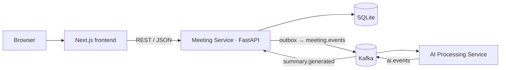

# Fireflies Clone — Meeting Notes & Transcription Platform

A Fireflies.ai-inspired meeting workspace: browse a meeting library, read interactive transcripts synced to a media
player, and review AI-generated summaries, chapters and action items. Built for the Scaler SDE Fullstack assignment.

> **Status:** Phase 0 (planning) complete — implementation not started. Sections marked _(pending)_ are filled in as
> the matching phase lands. Progress is tracked in [docs/REQUIREMENTS_MATRIX.md](docs/REQUIREMENTS_MATRIX.md).

## Demo
- Live app: _(pending — Phase 18)_
- API docs: _(pending)_ `/docs`
- Repository: _(pending — GitHub remote)_

## Overview
The platform recreates the Fireflies post-meeting experience. Real speech-to-text and live meeting bots are out of
scope (per the assignment); transcripts are seeded or uploaded (.txt / .vtt / .json / pasted text), and summaries are
produced asynchronously by a separate AI Processing Service through Kafka.

## Features
**Core (assignment must-haves)**
- Meetings library: title, date, duration, participants · title search · date & participant filters · sort by recency
- Meeting workspace: speaker-labelled, timestamped transcript · media player with seek bar · click-to-seek and
  playback-follows-transcript · in-transcript search with highlighted matches
- AI notes: overview, timestamped outline/chapters, keywords, extracted action items
- CRUD: create meetings (upload / paste / form), edit title & participants, delete; add / edit / complete / delete action items — all persisted
- Fireflies-style layout, modals, filters, toasts, settings placeholders; "Coming soon" for live bot, STT, integrations, team sharing

**Bonus** (after core is complete): global search · export TXT/Markdown · dark mode · tags — see [docs/BONUS_FEATURES.md](docs/BONUS_FEATURES.md)

## Tech Stack
| Layer | Choice |
|-------|--------|
| Frontend | Next.js (App Router) · TypeScript (strict) · Tailwind CSS · Radix UI primitives · TanStack Query · lucide-react · sonner |
| Meeting Service | Python 3.11 · FastAPI · SQLAlchemy 2.0 · Alembic · Pydantic v2 · aiokafka |
| AI Processing Service | Python 3.11 · FastAPI (health only) · aiokafka · pluggable `SummaryProvider` |
| Database | SQLite (WAL mode, foreign keys enforced) |
| Messaging | Apache Kafka (single-node KRaft) |
| Testing | pytest · pytest-cov · Playwright |
| Tooling / CI | ruff · mypy · ESLint · Prettier · GitHub Actions · Docker Compose |

## Architecture
Two services with one clear seam: the **Meeting Service** is the system of record and serves all REST traffic;
the stateless **AI Processing Service** turns transcripts into notes. They communicate only through Kafka, and only for
asynchronous work — CRUD never touches Kafka. Full detail: [docs/ARCHITECTURE.md](docs/ARCHITECTURE.md).

## Architecture Diagram


## Services
| Service | Port | Responsibility |
|---------|------|----------------|
| `frontend` | 3000 | UI |
| `meeting-service` | 8000 | REST API, persistence, transcript parsing, outbox relay, AI-result consumer |
| `ai-service` | 8001 | Consumes processing requests, generates summary/chapters/action items, publishes results |
| `kafka` | 9092 | Event broker |

## Kafka/Event Flow
`POST /api/meetings` → meeting + outbox row committed together → relay publishes `meeting.created` → AI service
generates notes → `summary.generated` → Meeting Service applies it idempotently → UI (polling while pending) shows
"Summary ready". Details, idempotency and failure handling: [docs/EVENT_DRIVEN_ARCHITECTURE.md](docs/EVENT_DRIVEN_ARCHITECTURE.md).

## Database Schema
`meetings` ⟷ `participants` (M:N via `meeting_participants`) · `transcript_segments` (speaker → participant) ·
`summaries` (1:1) → `summary_topics`, `summary_keywords` · `action_items` (assignee → participant) ·
infrastructure: `outbox_events`, `processed_events`. ER diagram and rationale: [docs/DATABASE_DESIGN.md](docs/DATABASE_DESIGN.md).

## API Overview
| Method | Path |
|--------|------|
| GET / POST | `/api/meetings` (search `q`, `participant_id`, `date_from`, `date_to`, `sort`, `limit`, `offset`) |
| GET / PATCH / DELETE | `/api/meetings/{id}` |
| GET | `/api/meetings/{id}/transcript` |
| GET | `/api/meetings/{id}/summary` · POST `/api/meetings/{id}/summary/regenerate` |
| GET / POST | `/api/meetings/{id}/action-items` |
| PATCH / DELETE | `/api/action-items/{id}` |
| GET | `/api/participants` |

Full contract: [docs/API.md](docs/API.md).

## Project Structure
```
backend/meeting-service   FastAPI system of record (routers → services → repositories → SQLAlchemy)
backend/ai-service        Stateless Kafka consumer/producer with pluggable summary providers
frontend                  Next.js + TypeScript app
docs                      Architecture, schema, API, events, testing, ADRs, interview guide
```

## Local Development
_(pending — Phase 2)_ Planned: `docker compose up --build` for everything, or run each service natively with
`EVENT_BUS=memory` to skip Kafka entirely.

## Environment Variables
_(pending — Phase 2; every variable will be listed in `.env.example` files)_

## Seed Data
_(pending — Phase 4)_ 7 realistic meetings (product, sales, engineering, hiring, design, 1:1, board prep) with 3–5 participants, full transcripts, summaries and action items.

## Testing
_(pending)_ Strategy: [docs/TESTING.md](docs/TESTING.md). Requirement → test mapping: [docs/TEST_COVERAGE_MATRIX.md](docs/TEST_COVERAGE_MATRIX.md).

## Coverage
_(pending — figures will be taken from generated reports only)_

## CI/CD
_(pending)_ See [docs/CI_CD.md](docs/CI_CD.md).

## Deployment
_(pending)_ See [docs/DEPLOYMENT.md](docs/DEPLOYMENT.md).

## Assumptions
- Single default logged-in user; no authentication (explicitly allowed by the assignment).
- One shared workspace: a participant's display name identifies them (case-insensitive) when transcripts are uploaded.
- Transcripts are text inputs; there is no real audio to transcribe. The player uses a sample/placeholder media source.
- AI summaries come from a deterministic mock provider by default; an LLM provider is optional and off unless a key is configured.

## Out of Scope
Live meeting bot · real speech-to-text · Zoom/Meet/calendar/CRM integrations · team sharing · real authentication — each shown as a "Coming soon" placeholder.

## Bonus Features
See [docs/BONUS_FEATURES.md](docs/BONUS_FEATURES.md).

## Trade-offs
See [docs/TRADEOFFS.md](docs/TRADEOFFS.md) and [docs/adr/](docs/adr/).

## Known Limitations
_(maintained as implementation progresses)_ SQLite limits the Meeting Service to a single writer instance.

## Future Improvements
_(maintained as implementation progresses)_

## Screenshots
_(pending — Phase 16)_
