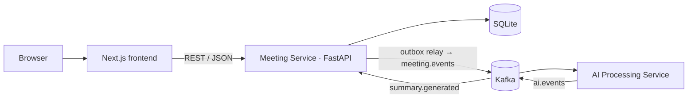

# Fireflies Clone — Meeting Notes & Transcription Platform

> **Status:** Phase 1 (architecture & documentation) complete — application code starts in Phase 2.
> Sections marked _(pending)_ are filled in by the phase that implements them. Live progress:
> [docs/REQUIREMENTS_MATRIX.md](docs/REQUIREMENTS_MATRIX.md).

## Overview
A Fireflies.ai-inspired meeting workspace built for the Scaler SDE Fullstack assignment. Browse a library of
meetings, open a meeting to read a speaker-labelled transcript synced to a media player, and review AI-generated
notes — keywords, overview, timestamped outline and action items. Real speech-to-text and live meeting bots are out
of scope (per the assignment): transcripts are seeded, uploaded (.txt / .vtt / .json) or pasted, and notes are
generated asynchronously by a separate AI Processing Service via Kafka.

## Demo
- Live app: _(pending — Phase 18)_
- API docs (Swagger): _(pending)_ `<api-url>/docs`
- Demo script: _(pending — Phase 19)_ `docs/FINAL_DEMO_SCRIPT.md`

## GitHub
- Repository: _(pending — public remote created before Phase 2 is merged)_
- Workflow: issue → feature branch → PR → CI → merge. See [docs/PROJECT_PLAN.md](docs/PROJECT_PLAN.md).

## Features
**Core (assignment must-haves)**
- Meetings library: title, date, duration, participants · title search · date & participant filters · sort by recency · profile/settings placeholders
- Meeting workspace: speaker-labelled, timestamped transcript · media player with seek bar · click a line to seek, playback highlights and scrolls to the active line · in-transcript search with highlighted matches
- AI notes: keywords, overview, notes, timestamped outline/chapters, extracted action items — with a visible processing state (Processing → Ready / Failed + Retry)
- CRUD: create meetings (upload / paste / form), edit title, date & participants, delete; add / edit / complete / delete action items — all persisted
- Fireflies-style layout, modals, filters, toasts; "Coming soon" for live bot, speech-to-text, integrations, team sharing

**Bonus** (only after every must-have is done): global search · export TXT/Markdown · dark mode · tags — see [docs/BONUS_FEATURES.md](docs/BONUS_FEATURES.md)

## Tech Stack
| Layer | Choice |
|-------|--------|
| Frontend | Next.js (App Router) · TypeScript (strict) · Tailwind CSS · Radix UI primitives · TanStack Query · lucide-react · sonner |
| Meeting Service | Python 3.11 · FastAPI · SQLAlchemy 2.0 · Alembic · Pydantic v2 · aiokafka |
| AI Processing Service | Python 3.11 · FastAPI (health + HTTP-mode endpoint) · aiokafka · pluggable `SummaryProvider` |
| Database | SQLite (WAL, foreign keys enforced) |
| Messaging | Apache Kafka (single-node KRaft, Docker) |
| Testing | pytest · pytest-cov · Playwright |
| Tooling / CI | ruff · mypy · ESLint · Prettier · GitHub Actions · Docker Compose |

Every choice is justified in [docs/adr/](docs/adr/).

## Architecture
Two services with one clear seam. The **Meeting Service** is the system of record and serves all REST traffic.
The stateless **AI Processing Service** turns transcripts into notes. They communicate only through events, and
only for asynchronous work — CRUD never touches Kafka. Full detail: [docs/ARCHITECTURE.md](docs/ARCHITECTURE.md).

## Architecture Diagram


## Services
| Service | Port | Responsibility |
|---------|------|----------------|
| `frontend` | 3000 | UI |
| `meeting-service` | 8000 | REST API, persistence, transcript parsing, outbox relay, AI-result consumer |
| `ai-service` | 8001 | Consumes processing requests, generates notes, publishes results |
| `kafka` | 9092 | Event broker (local / where hostable) |

## Kafka / Event Flow
`POST /api/meetings` → meeting + outbox row committed in one transaction (`pending`) → relay publishes
`meeting.created` (`processing`) → AI service generates notes → `summary.generated` → Meeting Service applies it
idempotently (`completed`) → the UI, polling while processing, shows "Notes ready".
`PROCESSING_MODE=kafka | http | inline-test` selects the transport; `http` is a documented fallback for hosts that
can't run a broker and reuses the same envelope and handlers.
Details: [docs/EVENT_DRIVEN_ARCHITECTURE.md](docs/EVENT_DRIVEN_ARCHITECTURE.md).

## Database Schema
`meetings` ⟷ `participants` (M:N via `meeting_participants`) · `transcript_segments` (speaker FK → participants) ·
`summaries` (1:1) → `summary_topics`, `summary_keywords` · `action_items` (assignee FK → participants) ·
infrastructure: `outbox_events`, `processed_events`.
ER diagram, constraints, indexes and rationale: [docs/DATABASE_DESIGN.md](docs/DATABASE_DESIGN.md).

## API Overview
| Method | Path |
|--------|------|
| GET / POST | `/api/meetings` (`q`, `participant_id`, `date_from`, `date_to`, `sort`, `limit`, `offset`) |
| GET / PATCH / DELETE | `/api/meetings/{id}` |
| GET | `/api/meetings/{id}/transcript` |
| GET | `/api/meetings/{id}/summary` · POST `/api/meetings/{id}/summary/regenerate` |
| GET / POST | `/api/meetings/{id}/action-items` |
| PATCH / DELETE | `/api/action-items/{id}` |
| GET | `/api/participants` |
| GET | `/health`, `/health/ready` |

Full contract with examples and error codes: [docs/API.md](docs/API.md).

## Project Structure
```
backend/meeting-service   FastAPI system of record (routers → services → repositories → SQLAlchemy)
backend/ai-service        Stateless event consumer/producer with pluggable summary providers
frontend/                 Next.js + TypeScript app
docs/                     Requirements, evaluation, architecture, schema, API, events, testing, ADRs, guides
.github/                  CI workflows, PR template
```
Detailed tree: [docs/ARCHITECTURE.md §8](docs/ARCHITECTURE.md#8-repository--folder-structure).

## Local Setup
_(pending — Phase 2)_ Planned: `docker compose up --build` for everything (Kafka included), or run each service
natively with `PROCESSING_MODE=inline-test` to skip Kafka.

## Environment Variables
_(pending — Phase 2; every variable will be listed in `.env.example` files)_. Planned set:
[docs/DEPLOYMENT.md §3](docs/DEPLOYMENT.md#3-configuration-finalized-in-phase-2-envexample-files).

## Seed Data
_(pending — Phase 3)_ 6–8 realistic business meetings (product sync, sprint review, client discovery, kickoff,
design review, hiring, marketing, quarterly planning), each with 3–5 participants, a full transcript, summary,
topics and action items.

## Testing
_(pending)_ Strategy: [docs/TESTING.md](docs/TESTING.md). Requirement → test mapping:
[docs/TEST_COVERAGE_MATRIX.md](docs/TEST_COVERAGE_MATRIX.md).

## Coverage
_(pending — figures are copied from generated reports only, never estimated)_

## CI/CD
_(pending — Phase 15)_ See [docs/CI_CD.md](docs/CI_CD.md).

## Deployment
_(pending — Phase 18)_ Free-first options and verification checklist: [docs/DEPLOYMENT.md](docs/DEPLOYMENT.md).

## Assumptions
- Single default logged-in user; no authentication (explicitly allowed by the assignment).
- One shared workspace: a participant's display name identifies them (case-insensitive) when transcripts are uploaded.
- Transcripts are text inputs; there is no real audio. The player uses a simulated playback clock with real controls.
- AI notes come from a deterministic mock provider by default; an LLM provider is optional and off unless configured.
- Ambiguous assignment wording and how we interpreted it: [docs/REQUIREMENTS_MATRIX.md §13](docs/REQUIREMENTS_MATRIX.md#13-interpretations-of-ambiguous-wording-decided-documented-revisitable).

## Out of Scope
Live meeting bot · real speech-to-text · Zoom/Meet/calendar/CRM integrations · team sharing · real authentication —
each shown as a "Coming soon" placeholder.

## Bonus Features
See [docs/BONUS_FEATURES.md](docs/BONUS_FEATURES.md).

## Design Trade-offs
See [docs/TRADEOFFS.md](docs/TRADEOFFS.md) and [docs/adr/](docs/adr/).

## Known Limitations
- SQLite allows one writer, so the Meeting Service runs as a single instance.
- Free hosting may not run Kafka; the hosted demo may use the documented HTTP processing mode.
_(maintained as implementation progresses)_

## Future Improvements
_(maintained as implementation progresses)_

## Screenshots
_(pending — Phase 16)_
