# Fireflies Clone — Meeting Notes & Transcription Platform

> **Status: submission-ready, pending publication.**
> - Every MUST-have requirement is implemented and verified by automated tests (backend, real Kafka and browser
>   end-to-end).
> - Four bonuses are done.
> - The production stack is verified locally.
> - Not yet done: publishing this repo and choosing a host. See
>   [FINAL_EVALUATION_REPORT.md](FINAL_EVALUATION_REPORT.md) for the strict self-assessment and the submission
>   checklist, and [docs/REQUIREMENTS_MATRIX.md](docs/REQUIREMENTS_MATRIX.md) for status by requirement.

## Overview
A Fireflies.ai-inspired meeting workspace built for the Scaler SDE Fullstack assignment. Browse a library of
meetings, open a meeting to read a speaker-labelled transcript synced to a media player, and review AI-generated
notes — keywords, overview, timestamped outline and action items. Real speech-to-text and live meeting bots are out
of scope (per the assignment): transcripts are seeded, uploaded (.txt / .vtt / .json) or pasted, and notes are
generated asynchronously by a separate AI Processing Service via Kafka.

## Demo
- Live app: _(not deployed yet — the hosting choice needs the author's approval; see [docs/DEPLOYMENT.md](docs/DEPLOYMENT.md))_
- Locally: `http://localhost:3000` after [Local Setup](#local-setup). There is no sign-in step: `/` redirects to the
  meetings library, and you are the default demo user, Alex Morgan (authentication is out of scope per the
  assignment).
- API docs (Swagger): `http://localhost:8000/docs`
- Demo walkthrough: [docs/FINAL_DEMO_SCRIPT.md](docs/FINAL_DEMO_SCRIPT.md)

## GitHub
- Repository: _(not published yet — publishing requires the author's authorization)_
- Workflow: issue → feature branch → logical commits → PR-style `--no-ff` merge into `main`. Until the repository is
  published, PR descriptions are kept in [docs/PULL_REQUESTS.md](docs/PULL_REQUESTS.md). See
  [docs/PROJECT_PLAN.md](docs/PROJECT_PLAN.md).

## Features
**Meetings library** — a Fireflies-style meetings table: weekly groups ("Oct 4 – Today · 3 meetings") with aligned
Meeting / Date / Time / Duration columns, participants, open action items and keyword tags, a details popover, and
multi-select with bulk delete · debounced title search (also from the top bar) · date presets and custom range · participant filter ·
newest/oldest sort · tag filter · filters live in the URL, so links and refreshes keep them.

**Meeting workspace** (Fireflies' meeting view): a one-line toolbar (breadcrumb, purple Share, copy link, ⋯), the AI
notes as the main column (~73 %) with the title on top, a compact transcript column on the right, and the player
docked below:
- **Transcript:** speaker-coloured avatars and names, timestamps, grouped consecutive lines.
- **Transcript ⇄ player:** click a line, chapter or action-item timestamp and the player seeks there and plays;
  playback or dragging the seek bar highlights the active line and scrolls it into view (pausing for a few seconds
  if you scroll yourself, with a "Back to current" button).
- **Search in transcript:** highlighted matches, current match, "n / m" counter, ↑/↓ and Enter / Shift+Enter.
- **AI notes:** keywords, overview, timestamped outline (click to seek), action items grouped by assignee, talk time.
- **Player:** play/pause, ±15 s, seek bar with a speaker timeline, 0.75–2× speed, keyboard shortcuts.

**Meeting management** — create by uploading a `.txt` / `.vtt` / `.json` transcript, pasting one, or a manual form ·
edit title, date and participants · delete · add / edit / complete / uncomplete / delete action items · everything
persists in SQLite.

**Asynchronous AI notes** — creating a meeting with a transcript returns immediately; the summary is generated by a
separate AI service via Kafka and the page updates itself ("Generating notes…" → toast "Your meeting notes are ready";
failures show the reason and a Retry button).

**Fireflies experience** — a narrow icon rail plus a contextual Meetings sidebar, compact one-line toolbars, a
white de-boxed canvas, dialogs, popovers, toasts for every action, loading / empty / error states everywhere, a Lumen
favicon, Light theme by default (Dark and System in Settings), settings (Profile, Appearance, and placeholder Notifications, Integrations and Team tabs) and "Coming soon"
dialogs for the live meeting bot, integrations, analytics and team sharing. Works down to phone width.

**Bonus** (only after every must-have is done): see [docs/BONUS_FEATURES.md](docs/BONUS_FEATURES.md).

### Assignment requirements at a glance
Where to find each core requirement from the brief. Every row is covered by an automated test
([docs/TEST_COVERAGE_MATRIX.md](docs/TEST_COVERAGE_MATRIX.md)) and was re-checked by hand in the running app.

| Brief | Where in the app |
|-------|------------------|
| Meetings list: title, date, duration, participants | `/meetings` table (Meeting · Date · Time · Duration; participants under the title) |
| Search / filter by title, date, participant; sort by recency | Filter bar above the table: *Search by title*, *Any time*, *Participants*, *Newest first* |
| Navbar with profile / settings placeholders | Avatar menu (top right) → Profile, Settings; Settings tabs |
| Transcript with speaker labels and timestamps | Meeting page, right column |
| Media player with a seek bar | Player docked at the bottom of a meeting (simulated playback clock) |
| Click a line → seek, and vice versa | Click any transcript line, outline chapter or action-item time; drag the seek bar or press Play to see the active line follow |
| Search within the transcript with highlights | *Find in transcript* (`/`), with n / m counter and ↑ / ↓ |
| AI summary, action items, outline / chapters | Notes column: Keywords, Overview, Outline, Action items, Talk time |
| Create (upload / paste / form), edit, delete | *New meeting* dialog (3 tabs); meeting ⋯ → Edit details / Delete; row ⋯ in the library |
| Add / edit / complete action items | Action items section (+ Add, hover → edit / delete, checkbox) |
| Everything persists | SQLite; survives refresh and restarts |
| Toasts, modals, forms, settings placeholders | Every mutation shows a toast; Coming-soon dialogs for live bot, integrations, team |

## Tech Stack
| Layer | Choice |
|-------|--------|
| Frontend | Next.js 16 (App Router) · React 19 · TypeScript (strict) · Tailwind CSS v4 · Radix UI · TanStack Query · lucide-react · sonner |
| Meeting Service | Python 3.11 · FastAPI · SQLAlchemy 2.1 · Alembic · Pydantic v2 · aiokafka |
| AI Processing Service | Python 3.11 · FastAPI (health + HTTP-mode endpoint) · aiokafka · pluggable `SummaryProvider` |
| Database | SQLite (WAL, foreign keys enforced) |
| Messaging | Apache Kafka (single-node KRaft, Docker) |
| Testing | pytest · pytest-cov · pytest-asyncio · Vitest · Playwright |
| Tooling / CI | ruff · mypy · ESLint · Prettier · GitHub Actions · Docker Compose |

Every choice is justified in [docs/adr/](docs/adr/).

## Architecture
Two services with one clear seam. The **Meeting Service** is the system of record and serves all REST traffic.
The stateless **AI Processing Service** turns transcripts into notes. They communicate only through events, and
only for asynchronous work — CRUD never touches Kafka. Full detail: [docs/ARCHITECTURE.md](docs/ARCHITECTURE.md).

## Architecture Diagram
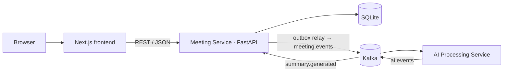

## Services
| Service | Port | Responsibility |
|---------|------|----------------|
| `frontend` | 3000 | UI |
| `meeting-service` | 8000 | REST API, persistence, transcript parsing, outbox relay, AI-result consumer |
| `ai-service` | 8001 | Consumes processing requests, generates notes, publishes results |
| `kafka` | 9092 | Event broker (local / where hostable) |

## Kafka / Event Flow
`POST /api/meetings` → meeting + outbox row committed in one transaction (`pending`) → relay publishes
`meeting.created` (`processing`) → AI service generates notes → `summary.generated` → Meeting Service applies it
idempotently (`completed`) → the UI, polling while processing, shows "Notes ready".
`PROCESSING_MODE=kafka | http | inline-test` selects the transport; `http` is a documented fallback for hosts that
can't run a broker and reuses the same envelope and handlers.
Details: [docs/EVENT_DRIVEN_ARCHITECTURE.md](docs/EVENT_DRIVEN_ARCHITECTURE.md).

## Database Schema
`meetings` ⟷ `participants` (M:N via `meeting_participants`) · `transcript_segments` (speaker FK → participants) ·
`summaries` (1:1) → `summary_topics`, `summary_keywords` · `action_items` (assignee FK → participants) ·
infrastructure: `outbox_events`, `processed_events`.
ER diagram, constraints, indexes and rationale: [docs/DATABASE_DESIGN.md](docs/DATABASE_DESIGN.md).

## API Overview
| Method | Path |
|--------|------|
| GET / POST | `/api/meetings` (`q`, `participant_id`, `date_from`, `date_to`, `keyword`, `sort`, `limit`, `offset`) |
| GET / PATCH / DELETE | `/api/meetings/{id}` |
| GET | `/api/meetings/{id}/transcript` |
| GET | `/api/meetings/{id}/summary` · POST `/api/meetings/{id}/summary/regenerate` |
| GET / POST | `/api/meetings/{id}/action-items` |
| PATCH / DELETE | `/api/action-items/{id}` |
| GET | `/api/participants` |
| GET | `/api/search?q=` (bonus: global search over titles and transcripts) |
| GET | `/health`, `/health/ready` |

Full contract with examples and error codes: [docs/API.md](docs/API.md).

## Project Structure
```
backend/meeting-service   FastAPI system of record
  app/routers · services · repositories · models · schemas   HTTP → rules → SQL → tables → contracts
  app/events/             envelope, payloads, publishers (kafka | http | in-memory), outbox relay, result consumer
  app/seed/               7 demo meetings (python -m app.seed)
  alembic/                migrations · samples/  example .txt/.vtt/.json transcripts · tests/  pytest suites
backend/ai-service        stateless worker: providers (mock), processor (retries), Kafka consumer, HTTP fallback
frontend/                 Next.js app
  app/                    routes: /meetings, /meetings/[id], /settings
  components/             layout · meetings · workspace · transcript · audio · summary · action-items · settings · ui
  hooks/                  TanStack Query hooks, usePlaybackClock
  lib/                    API client, types, playback clock, active-segment search, transcript search, filters
  tests/e2e/              Playwright specs (run against the real stack)
docs/                     requirements, evaluation, architecture, schema, API, events, testing, ADRs, guides
```

## Local Setup
**Prerequisites** (versions used and tested):

| Tool | Version | Needed for |
|------|---------|------------|
| Git | any recent | cloning |
| Python | 3.11 | both backend services, backend tests, Playwright's backend servers |
| Node.js | 22 or newer (`engines: >=22`) | frontend |
| Docker Desktop (Compose v2) | any recent | Kafka (Options A and B), real-Kafka tests, the production stack |

The commands below use bash (Git Bash on Windows). In PowerShell, activate a virtual environment with
`.venv\Scripts\Activate.ps1` and copy files with `copy`. SQLite needs no installation: the Meeting Service creates and
migrates its database file (`backend/meeting-service/data/meetings.db`) on first start.

**Option A: backend in Docker, frontend native (closest to the real architecture)**
```bash
git clone <repo-url> fireflies-clone && cd fireflies-clone
docker compose up -d --build --wait     # Kafka (KRaft) + meeting-service :8000 (seeds itself) + ai-service :8001
cd frontend && npm install && cp .env.example .env.local && npm run dev   # http://localhost:3000
```

**Option B: everything native, with Kafka in Docker**
```bash
docker compose up -d --wait kafka       # broker on localhost:9092

# Terminal 1: Meeting Service
cd backend/meeting-service
python -m venv .venv && source .venv/Scripts/activate      # macOS/Linux: source .venv/bin/activate
pip install -r requirements-dev.txt && cp .env.example .env
python -m app.seed                                          # migrate + load the 7 demo meetings
uvicorn app.main:create_app --factory --reload --port 8000  # http://localhost:8000/docs

# Terminal 2: AI Processing Service
cd backend/ai-service
python -m venv .venv && source .venv/Scripts/activate
pip install -r requirements-dev.txt && cp .env.example .env
uvicorn app.main:create_app --factory --reload --port 8001

# Terminal 3: frontend
cd frontend
npm install && cp .env.example .env.local && npm run dev    # http://localhost:3000
```

**Option C: no Docker at all (HTTP fallback, no Kafka).** Do Option B without the `docker compose` line, after
setting these in the two `.env` files. Use the same token value in both; any long random string works locally.
```bash
# backend/meeting-service/.env
PROCESSING_MODE=http
INTERNAL_API_TOKEN=change-me-to-a-long-random-string
# backend/ai-service/.env
PROCESSING_MODE=http
INTERNAL_API_TOKEN=change-me-to-a-long-random-string
```
`inline-test` mode is for automated tests only: it processes nothing, so new meetings would stay "pending".

**URLs once running**

| What | URL |
|------|-----|
| App (redirects to the library) | http://localhost:3000 → http://localhost:3000/meetings |
| Meeting Service API docs | http://localhost:8000/docs |
| Meeting Service health | http://localhost:8000/health (liveness) · http://localhost:8000/health/ready (database) |
| AI Service health | http://localhost:8001/health |
| Kafka (Options A and B) | `localhost:9092` |

## Environment Variables
Each deployable reads its own environment (12-factor); every variable is documented in its `.env.example`.
Real `.env` files are git-ignored.

| File | Key variables |
|------|---------------|
| [backend/meeting-service/.env.example](backend/meeting-service/.env.example) | `DATABASE_URL`, `CORS_ORIGINS`, `PROCESSING_MODE` (`kafka` \| `http` \| `inline-test`), `KAFKA_*`, `AI_SERVICE_URL`, `INTERNAL_API_TOKEN` |
| [backend/ai-service/.env.example](backend/ai-service/.env.example) | `PROCESSING_MODE` (`kafka` \| `http`), `KAFKA_*`, `INTERNAL_API_TOKEN`, `SUMMARY_PROVIDER` (only `mock` ships), `MAX_RETRIES`, `RETRY_BACKOFF_SECONDS` |
| [frontend/.env.example](frontend/.env.example) | `NEXT_PUBLIC_API_URL` |

`PROCESSING_MODE=http` refuses to start without `INTERNAL_API_TOKEN`, so misconfiguration fails fast. The Meeting
Service also reads `SEED_ON_STARTUP` (default `false`; Docker Compose sets it to `true`). No API keys or other
secrets are needed to run the project.

## Seed Data
Seven meetings at a fictional company (Northwind, makers of a route-planning product): product sync, sprint review,
client discovery call, design review, hiring debrief, marketing strategy and Q1 planning. Each has 3–5 participants
drawn from 11 recurring people, a full timestamped transcript, an overview, keywords, a chaptered outline and action
items. Dates are relative to today so the date filters always have something to show.
```bash
cd backend/meeting-service
python -m app.seed            # migrates, then seeds only if the database has no meetings (safe to re-run)
python -m app.seed --reset    # DELETES ALL meetings in the configured DATABASE_URL, then reseeds
docker compose exec meeting-service python -m app.seed --reset   # the same, for the Docker database (Option A)
```
`--reset` only touches the database in `DATABASE_URL` (default `data/meetings.db`). The Playwright tests use their own
file (`data/e2e.db`), so running them never resets your data. Docker deployments can set `SEED_ON_STARTUP=true` to
seed an empty database automatically.

## Testing
| Suite | What it covers | Result (latest local run) |
|-------|----------------|---------------------------|
| Meeting Service — pytest | API, schema constraints, migrations, parser, seed, outbox relay, consumer, idempotent results | 183 passed · 97 % coverage |
| Meeting Service — `pytest -m kafka` | Real broker: round trip, full pipeline through the AI service container, duplicate delivery applied once | 3 passed |
| AI service — pytest | Mock provider heuristics, retries/failures, Kafka loop, HTTP endpoint auth | 39 passed · 99 % coverage |
| Frontend — Vitest | Active-segment search, playback clock, transcript search, filters, formatting, export, theme | 76 passed |
| Frontend — Playwright | Every must-have workflow plus bonuses in a real browser against the real stack | 45 passed |

```bash
# Backend: unit + integration (each service's virtual environment active)
cd backend/meeting-service && pytest --cov
cd backend/ai-service      && pytest --cov

# Real Kafka: needs the broker and the AI service container
docker compose up -d --build --wait kafka ai-service
cd backend/meeting-service && pytest -m kafka -v

# Frontend unit tests
cd frontend && npm test

# Playwright: needs each service's .venv from Option B (or set E2E_PYTHON to a Python with both services'
# requirements). It starts the AI service on :8101, the Meeting Service on :8100 (its own data/e2e.db,
# reseeded each run) and a production frontend build on :3100.
cd frontend && npx playwright install chromium && npm run test:e2e
```
Requirement → test mapping: [docs/TEST_COVERAGE_MATRIX.md](docs/TEST_COVERAGE_MATRIX.md). Strategy: [docs/TESTING.md](docs/TESTING.md).

## Coverage
Measured with `pytest --cov` (line + branch) on the latest run: **Meeting Service 97.45 %**, **AI service 98.84 %**.
CI fails below 90 %. Frontend logic is covered by Vitest; user workflows by Playwright (no line-coverage target —
requirement coverage is the goal, see the matrix).

## CI/CD
[`.github/workflows/ci.yml`](.github/workflows/ci.yml) runs on pull requests and pushes to `main`: backend
lint/format/strict types/tests + 90 % coverage gate (both services), event-contract check, a real-Kafka job, and frontend
lint/format/types/unit/build/Playwright. Every job's commands pass locally, but **the workflow has not run on GitHub
yet**: that happens on the first push. See [docs/CI_CD.md](docs/CI_CD.md).

## Deployment
A production stack is ready in [`deploy/`](deploy): Caddy (automatic HTTPS, one origin), the Next.js standalone
image, both services and **real Kafka**, all on one free VM. It has been verified locally: summaries are processed
through Kafka, and data persists across a full restart.

```bash
cp deploy/.env.example deploy/.env   # set SITE_ADDRESS / PUBLIC_URL
docker compose -f deploy/docker-compose.prod.yml --env-file deploy/.env up -d --build --wait
```

Options, steps, backups and the post-deploy checklist are in [docs/DEPLOYMENT.md](docs/DEPLOYMENT.md). The host is
not chosen yet; that is the author's decision, and **nothing is deployed**.

## Troubleshooting
| Symptom | Cause and fix |
|---------|---------------|
| Notes stay "Generating notes…" | **Most common cause:** the two services use different `PROCESSING_MODE`s. Running `docker compose up … ai-service` (for example for the Kafka tests) puts the Docker AI service on port 8001 in `kafka` mode, so a native Meeting Service started in `http` mode gets 404s from `/internal/process`. Run the Meeting Service in `kafka` mode as well (the default), or stop the container and start the AI service natively in `http` mode. Otherwise the AI service or Kafka isn't running, or the modes don't match. Check `http://localhost:8001/health` and `docker compose ps`; both services must use the same `PROCESSING_MODE` (and the same token in `http` mode). Requests wait safely in the outbox and are processed once the broker is back |
| Meeting Service exits on start: `INTERNAL_API_TOKEN` | `http` mode needs the token set in both `.env` files (Option C) |
| Library shows "Couldn't load meetings" | The Meeting Service isn't reachable at `NEXT_PUBLIC_API_URL` (default `http://localhost:8000`), or the frontend's origin isn't in `CORS_ORIGINS`. Restart `npm run dev` after editing `.env.local` |
| `port is already allocated` from Docker | Another process uses 9092, 8000 or 8001. Stop it, or stop the native services before Option A |
| The library is empty | Run `python -m app.seed` (native) or set `SEED_ON_STARTUP=true` (Docker) |
| Playwright can't start the backend | Create both `.venv`s (Option B), or set `E2E_PYTHON`. Ports 3100, 8100 and 8101 must be free |
| Kafka tests hang or fail | Start the broker and the AI container first: `docker compose up -d --build --wait kafka ai-service` |

## Assumptions
- Single default logged-in user; no authentication (explicitly allowed by the assignment).
- One shared workspace: a participant's display name identifies them (case-insensitive) when transcripts are uploaded.
- Transcripts are text inputs; there is no real audio. The player uses a simulated playback clock with real controls
  (an info icon in the player says so); a real recording would plug in behind the same `PlaybackClock` interface.
- Library date filters use UTC calendar days; displayed times use the browser's time zone.
- The product is named **Lumen** with an original logo: the UI follows Fireflies' layout and patterns without using its brand.
- AI notes come from a deterministic mock provider; no LLM provider ships (ADR-007 shows where one would plug in).
- Ambiguous assignment wording and how we interpreted it: [docs/REQUIREMENTS_MATRIX.md §13](docs/REQUIREMENTS_MATRIX.md#13-interpretations-of-ambiguous-wording-decided-documented-revisitable).

## Out of Scope
Live meeting bot · real speech-to-text · Zoom/Meet/calendar/CRM integrations · team sharing · real authentication —
each shown as a "Coming soon" placeholder. There is deliberately no login page or marketing landing page: the app
opens straight into the library as the default demo user.

## Bonus Features
Built only after every MUST-have was verified; details and tests in [docs/BONUS_FEATURES.md](docs/BONUS_FEATURES.md).

| Bonus | Where to find it |
|---|---|
| Global search across all meetings | Top-bar search; results deep-link to the exact transcript moment |
| Export (TXT / Markdown) | Meeting ⋯ menu → **Download**: transcript or AI notes, with timestamp/speaker options |
| Dark mode | Light by default for new visitors. Settings → **Appearance**: System / Light / Dark (saved per browser; System follows the OS live); quick toggle in the account menu |
| Tags | AI keywords appear as chips on meetings and in notes; clicking one filters the library |

Deferred on purpose: comments on transcript lines and an "Ask" chat (a convincing chat needs a real LLM; see
BONUS_FEATURES).

## Design Trade-offs
See [docs/TRADEOFFS.md](docs/TRADEOFFS.md) and [docs/adr/](docs/adr/).

## Known Limitations
- SQLite allows one writer, so the Meeting Service runs as a single instance.
- Playback is simulated by a clock, since there is no real audio. The `PlaybackClock` interface is where a real
  `<audio>` element would plug in.
- AI notes come from a deterministic mock provider (heuristics over the transcript). No LLM is called.
- The outbox relay polls (sub-second), and there is no dead-letter topic. Failed processing is shown in the UI with a
  retry button.
- Date filters use UTC day boundaries.
- Authentication, live meeting bots, integrations and sharing are "Coming soon" placeholders, as the brief allows.

## Future Improvements
- An LLM summary provider behind the existing `SummaryProvider` interface (ADR-007), plus an "Ask" chat grounded in
  transcript segments.
- Comments and highlights on transcript lines (bonus B1).
- SQLite FTS5 for global search once the data outgrows `LIKE`.
- A dead-letter topic and an admin view of failed events.
- Real audio/video playback through an `AudioElementClock`.
- Postgres (or Litestream backups) if write concurrency or durability needs grow.

## Screenshots
Captured from the running application (seeded data).

| Meetings library | Meeting workspace (playing, active line followed) |
|---|---|
| 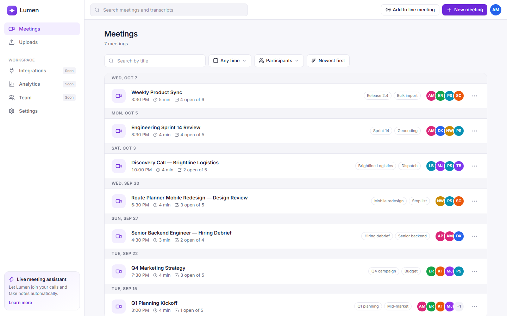 | 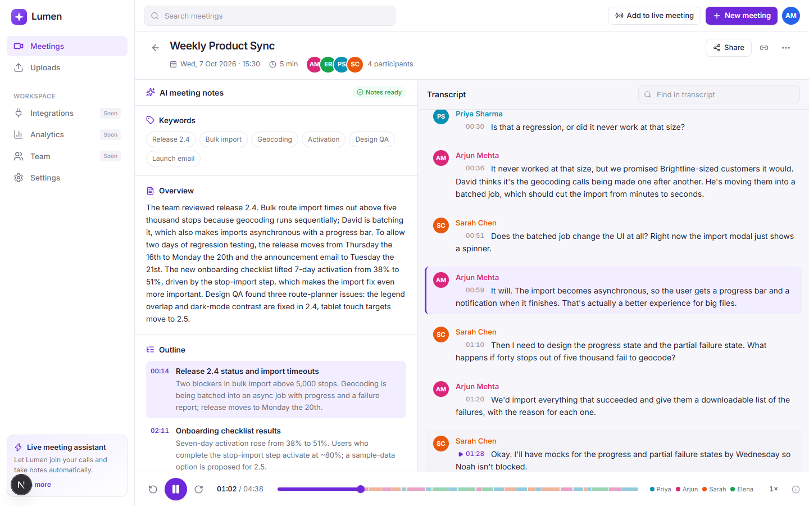 |
| **Search within the transcript** | **New meeting dialog** |
| 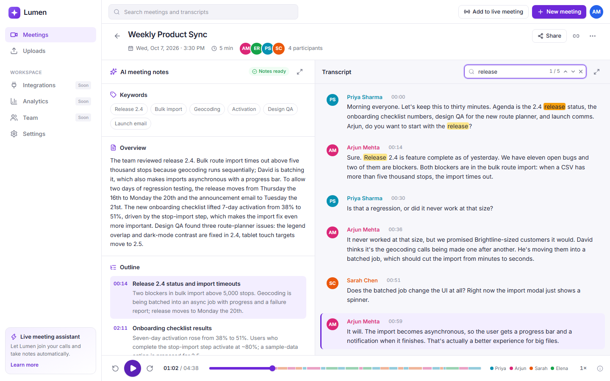 | 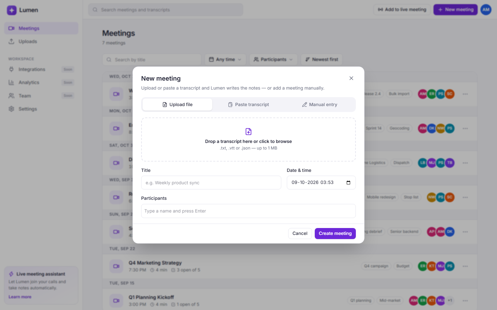 |
| **Filters (last 30 days, one participant)** | **Phone width** |
| 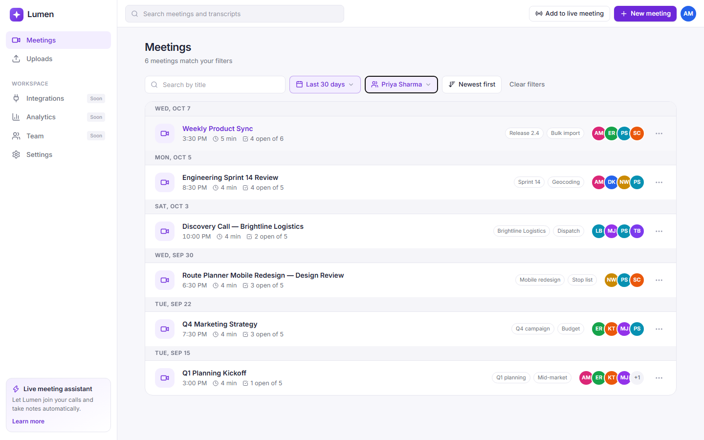 | 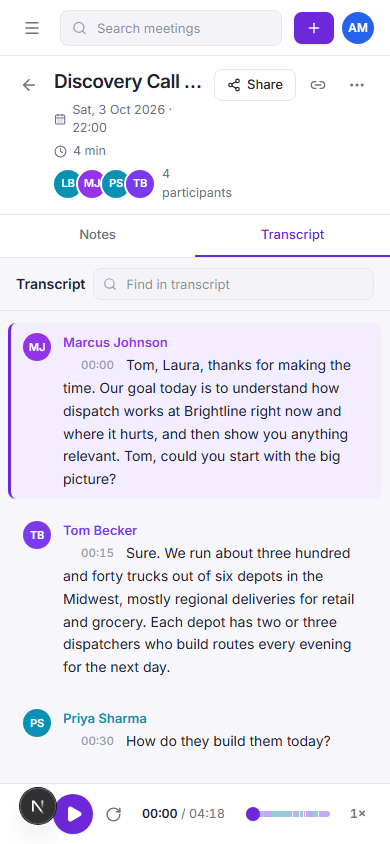 |
| **Dark mode — library** | **Dark mode — transcript expanded, searching** |
| 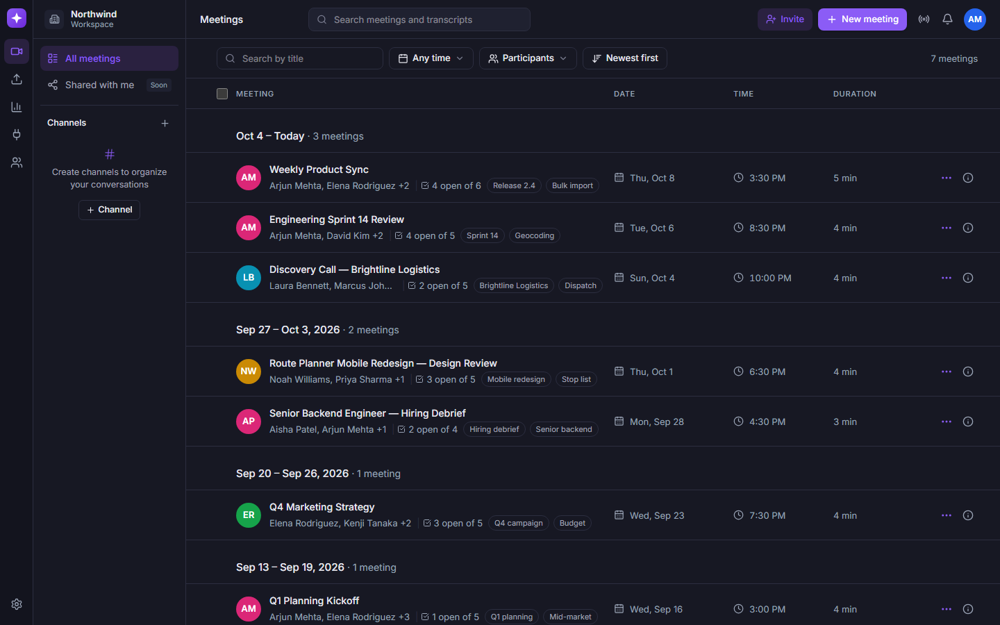 | 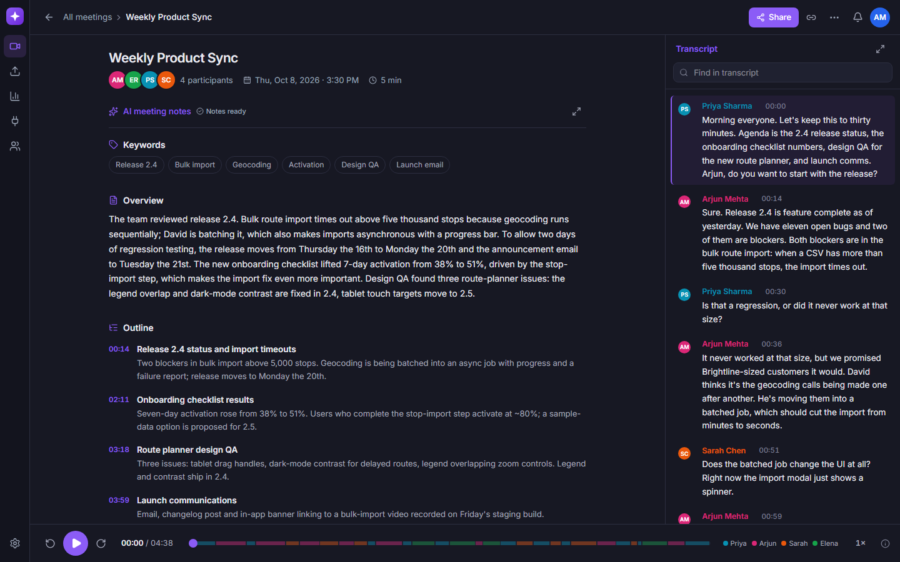 |
| **Settings → Appearance (System / Light / Dark)** | **Library at tablet width (1024 px)** |
| 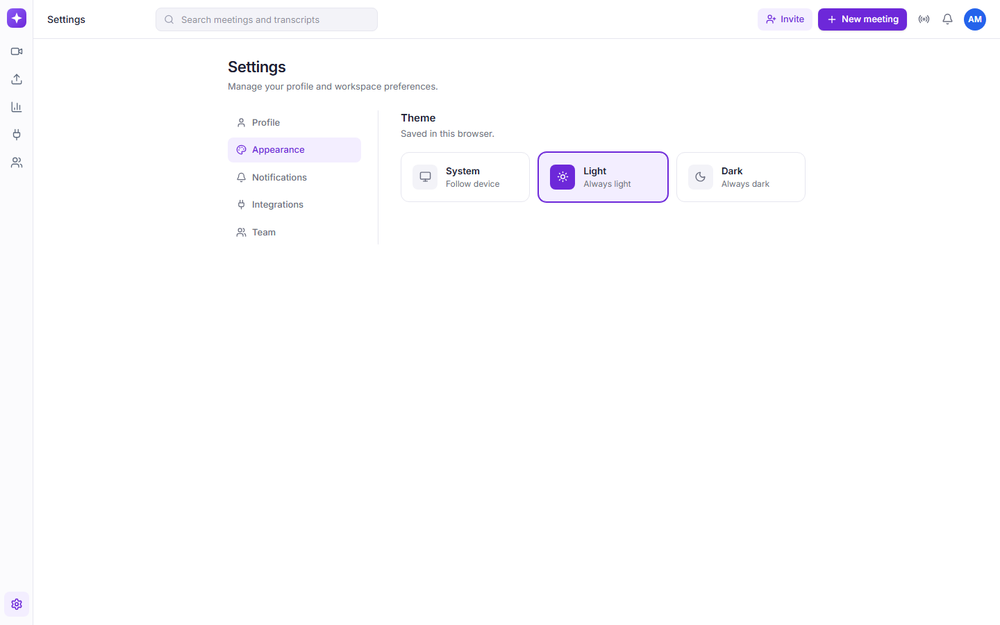 | 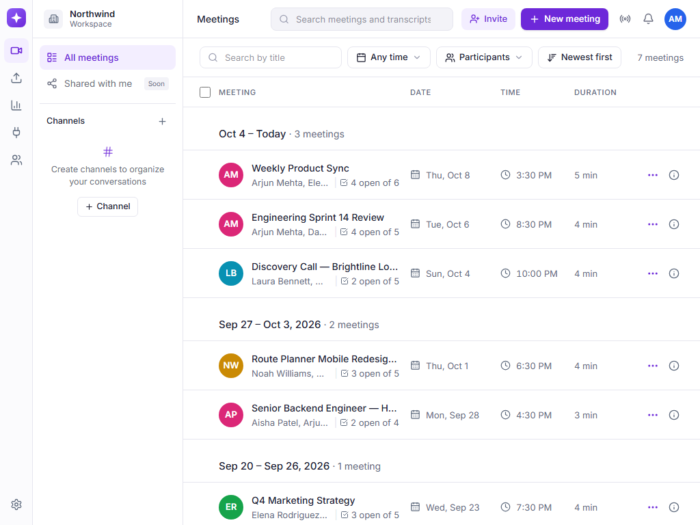 |
