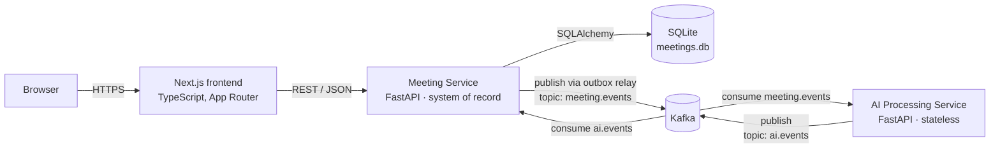

# Architecture

> Status: **Proposed (Phase 0)** — awaiting approval. Sections marked *(Phase N)* get finalized in that phase.

## 1. Goals that shaped the architecture

1. Every PDF must-have works reliably (priority #1).
2. Demonstrate service decomposition + asynchronous, event-driven processing **without** decorative infrastructure.
3. Small enough that one developer can explain every box and arrow.

## 2. Component diagram



| Component | Owns | Does NOT own |
|-----------|------|--------------|
| **Frontend** | Rendering, client-side transcript search, player ↔ transcript sync, optimistic UI | Business rules, persistence |
| **Meeting Service** | All data (meetings, participants, transcript, summaries, action items), REST API, validation, transcript parsing, outbox, consuming AI results | Generating summaries |
| **AI Processing Service** | Turning a transcript snapshot into overview + chapters + keywords + action items | Any database. It is stateless: input event in, result event out |
| **Kafka** | Durable, ordered (per meeting) delivery of processing requests/results | Synchronous CRUD |
| **SQLite** | Single file database for Meeting Service | — |

## 3. Request flow — synchronous CRUD (no Kafka)

```
GET /meetings/42  (browser)
  → Next.js page (client component) → fetch GET {API}/api/meetings/42
    → router  (HTTP: parse params, map errors to status codes)
    → service (business rules: e.g. 404 if missing)
    → repository (SQLAlchemy query, eager-load participants)
    → SQLite
  ← Pydantic response model → JSON
```

CRUD is synchronous because the user is waiting for the answer and needs read-your-own-writes.
Putting Kafka in that path would add latency and eventual consistency with zero benefit.

## 4. Event flow — asynchronous summary generation

```mermaid
sequenceDiagram
    participant FE as Frontend
    participant MS as Meeting Service
    participant DB as SQLite
    participant K as Kafka
    participant AI as AI Service
    FE->>MS: POST /api/meetings (transcript)
    MS->>DB: BEGIN; insert meeting, segments, participants;<br/>status=pending; insert outbox(meeting.created); COMMIT
    MS-->>FE: 201 Created {processing_status: "pending"}
    loop every ~1s
        MS->>DB: read unpublished outbox rows
        MS->>K: produce to meeting.events (key = meeting_id)
        MS->>DB: mark outbox row published
    end
    K->>AI: meeting.created (transcript snapshot, transcript_revision)
    AI->>AI: SummaryProvider.generate()
    AI->>K: summary.generated → ai.events (key = meeting_id)
    K->>MS: summary.generated
    MS->>DB: BEGIN; check processed_events; check revision is current;<br/>upsert summary/topics; replace ai-sourced action items;<br/>status=completed; record event_id; COMMIT
    FE->>MS: poll GET /api/meetings/{id} while status ∈ {pending, processing}
    MS-->>FE: status=completed → toast "Summary ready"
```

The frontend polls (every 2 s, only while a summary is pending, stops after completion/failure).
Polling was chosen over WebSockets/SSE: one page needs it, it is trivially explainable, and it works through every hosting proxy.

## 5. Consistency model

* **Strong consistency** for everything the user writes directly (CRUD is a single SQLite transaction).
* **Eventual consistency** only for AI output. The UI models this explicitly with `processing_status`
  (`pending → processing → completed | failed`) instead of pretending it is instant.
* **Stale-result protection:** each meeting has a `transcript_revision`. Events carry it; a `summary.generated`
  for an older revision is discarded, so a slow result can never overwrite a newer one.

## 6. Failure scenarios

| Failure | Behaviour | User sees |
|---------|-----------|-----------|
| Kafka down when a meeting is created | Meeting + outbox row commit normally; relay retries with backoff until the broker is back | Meeting created; summary "Processing…" until Kafka recovers |
| Meeting Service crashes after commit, before publish | Outbox row is still unpublished → published on restart (at-least-once) | Nothing unusual |
| AI Service down | Events wait in Kafka (retained); consumed when it restarts | "Processing…" longer |
| AI Service fails on an event | Retries N times with backoff, then publishes `summary.failed` | "Summary failed — Retry" button → `POST /api/meetings/{id}/summary/regenerate` |
| Duplicate delivery (at-least-once) | `processed_events` table rejects already-applied `event_id` | Nothing |
| Out-of-order / stale result | `transcript_revision` check discards it | Nothing |
| SQLite locked (concurrent writers) | WAL mode + `busy_timeout`; single process writer | Nothing at this scale |
| Frontend API failure | Error state with retry; mutation errors toast and roll back optimistic updates | Clear message |

## 7. Trade-offs (summary — details in [TRADEOFFS.md](TRADEOFFS.md) and [adr/](adr/))

* Two services, not five: the only real seam is "slow, replaceable AI work" vs "system of record".
* Kafka over a simple background task: the PDF does not need it; it is included as a deliberate, documented
  demonstration of async decoupling. The `EventBus` interface keeps an in-memory implementation for tests
  so the core app never *depends* on Kafka to be understood or tested.
* SQLite: required by the PDF; fine for single-instance. Limits horizontal scaling of the Meeting Service
  (documented migration path to PostgreSQL).

## 8. Repository / folder structure

```
fireflies-clone/
├── README.md
├── docker-compose.yml            # kafka + meeting-service + ai-service + frontend
├── .github/workflows/ci.yml
├── docs/                         # this documentation set + adr/
├── backend/
│   ├── meeting-service/
│   │   ├── app/
│   │   │   ├── main.py           # app factory, lifespan (start/stop relay + consumer)
│   │   │   ├── config.py         # pydantic-settings
│   │   │   ├── database.py       # engine, session, SQLite pragmas
│   │   │   ├── errors.py         # domain exceptions + handlers → error envelope
│   │   │   ├── models/           # SQLAlchemy ORM
│   │   │   ├── schemas/          # Pydantic request/response
│   │   │   ├── routers/          # meetings, transcript, summary, action_items, participants, health
│   │   │   ├── services/         # business logic; transcript_parsers/ (txt, vtt, json)
│   │   │   ├── repositories/     # all SQL lives here
│   │   │   └── events/           # envelope, event_bus (kafka | memory), outbox relay, ai result consumer
│   │   ├── alembic/              # migrations
│   │   ├── seed/                 # seed.py + meetings/*.json (realistic data)
│   │   ├── tests/                # unit/, integration/
│   │   ├── pyproject.toml        # deps, ruff, pytest, coverage config
│   │   └── Dockerfile
│   └── ai-service/
│       ├── app/
│       │   ├── main.py           # lifespan starts consumer; /health
│       │   ├── config.py
│       │   ├── consumers/        # meeting.events consumer + retry policy
│       │   ├── processors/       # orchestrates provider → result event
│       │   ├── providers/        # SummaryProvider, MockSummaryProvider, LLMSummaryProvider
│       │   └── events/           # envelope + producer
│       ├── tests/
│       ├── pyproject.toml
│       └── Dockerfile
└── frontend/
    ├── app/                      # meetings/, meetings/[id]/, settings/, integrations/, layout.tsx
    ├── components/               # layout/, meetings/, transcript/, summary/, action-items/, audio/, ui/
    ├── hooks/                    # useMediaClock, useActiveSegment, useTranscriptSearch, useMeetingPolling
    ├── lib/                      # api.ts (typed client), types.ts, format.ts, highlight.ts
    ├── tests/e2e/                # Playwright
    └── package.json
```

Event schemas are defined once per service in `events/envelope.py`. They are intentionally duplicated (two small
Pydantic models) rather than shared through a common package: independent deployability beats DRY across service
boundaries, and a contract test in each service pins the shape.

## 9. Deployment topology — *see [DEPLOYMENT.md](DEPLOYMENT.md); pending decision D1*
