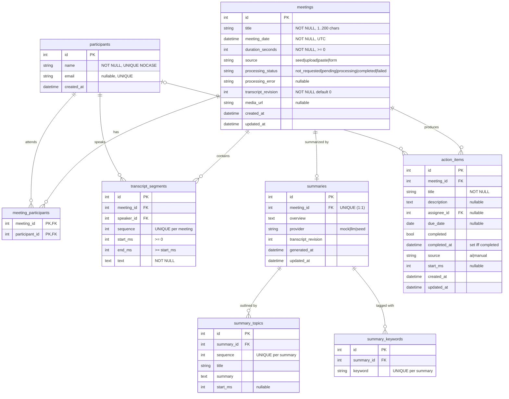

# Database Design

> Status: **Implemented (Milestone A)** — models in `backend/meeting-service/app/models/`, migration
> `alembic/versions/0001_initial_schema.py`, seed in `app/seed/`. Constraints are verified by `tests/integration/test_schema.py`;
> `tests/integration/test_migrations.py` proves the migration builds exactly the schema the models describe.
> Engine: SQLite 3 via SQLAlchemy 2.0 (ORM, typed `Mapped[]` models). Owned exclusively by the Meeting Service.

## 1. ER diagram



Infrastructure tables (not part of the domain model, used by the event pipeline):

```
outbox_events     (id TEXT PK [= envelope event_id], event_type, aggregate_id, envelope TEXT [serialized EventEnvelope],
                   created_at, published_at NULL, attempts, last_error)   partial index on created_at WHERE published_at IS NULL
processed_events  (event_id TEXT PK, event_type, outcome [applied|stale|meeting_missing], processed_at)
```

## 2. Tables

### `meetings` — the aggregate root
| Column | Type | Constraint | Why |
|--------|------|-----------|-----|
| `id` | INTEGER | PK | Surrogate key; titles aren't unique |
| `title` | VARCHAR(200) | NOT NULL, `CHECK(length(trim(title)) > 0)` | Required by R1.1 |
| `meeting_date` | DATETIME | NOT NULL, indexed | When the meeting happened (≠ `created_at`, when the row was inserted). Used for sort + date filter |
| `duration_seconds` | INTEGER | NOT NULL, `CHECK(>= 0)` | Shown in list. Stored (not computed from segments) because the list page must not aggregate transcripts and a form-created meeting has no transcript |
| `source` | VARCHAR(16) | `CHECK IN (...)` | How it was created — shown as "Uploaded" badge, useful for debugging |
| `processing_status` | VARCHAR(16) | `CHECK IN (...)`, default `not_requested` | Makes eventual consistency visible to the UI |
| `processing_error` | TEXT | nullable | Last failure reason for `failed` |
| `transcript_revision` | INTEGER | NOT NULL default 0 | Incremented on every transcript change; protects against stale AI results |
| `media_url` | VARCHAR | nullable | Placeholder/sample media; null ⇒ player uses a simulated clock |
| `created_at` / `updated_at` | DATETIME | NOT NULL | Audit |

### `participants`
A person known to the workspace (single default user ⇒ one shared address book).
`name` is unique case-insensitively (`COLLATE NOCASE`) so "priya sharma" in an uploaded transcript resolves to the
existing "Priya Sharma". `email` is unique when present (SQLite allows multiple NULLs in a UNIQUE column).
*Assumption:* within one workspace a display name identifies a person. Documented in README.

### `meeting_participants` — M:N join
Composite PK `(meeting_id, participant_id)` makes duplicate membership impossible. Separate index on
`participant_id` because the participant filter queries "meetings for participant X" (the PK index only helps
when `meeting_id` is the leading column).

### `transcript_segments`
One row per utterance. `speaker_id` is an FK to `participants` rather than a free-text speaker name:
the name lives in one place (rename once → every line updates), and "who spoke" is joinable for filters and
talk-time stats. Times are **integer milliseconds** — exact comparison, no float drift during sync.
`UNIQUE(meeting_id, sequence)` guarantees a deterministic order and doubles as the lookup index.

### `summaries` (1:1 with meeting) · `summary_topics` · `summary_keywords`
`UNIQUE(meeting_id)` enforces at most one summary per meeting; regeneration **updates** it instead of inserting.
Topics are the outline/chapters (with optional `start_ms` so clicking a chapter seeks the player).
Keywords are a child table, not a comma-separated string (1NF; filterable later for bonus B4).

### `action_items`
Owned by the meeting. `assignee_id` → `participants` (nullable — unassigned is valid).
`source` distinguishes AI-extracted from user-created items. **Rule:** when the user edits an AI item, it becomes
`manual`; regeneration only replaces `source='ai'` items, so user work is never destroyed by the AI pipeline.
`CHECK ((completed = 1) = (completed_at IS NOT NULL))` keeps the two fields consistent at the DB level.

## 3. Keys, cardinalities, deletion behaviour

| Relationship | Cardinality | FK | ON DELETE | Reason |
|-------------|-------------|----|-----------|--------|
| meeting → meeting_participants | 1 : N | `meeting_id` | CASCADE | Membership has no meaning without the meeting |
| participant → meeting_participants | 1 : N | `participant_id` | RESTRICT | Can't delete a person still in meetings |
| meeting → transcript_segments | 1 : N | `meeting_id` | CASCADE | Owned child |
| participant → transcript_segments | 1 : N | `speaker_id` | RESTRICT | Would orphan transcript lines |
| meeting → summaries | 1 : 0..1 | `meeting_id` UNIQUE | CASCADE | Owned child |
| summary → topics / keywords | 1 : N | `summary_id` | CASCADE | Owned child |
| meeting → action_items | 1 : N | `meeting_id` | CASCADE | Owned child |
| participant → action_items | 1 : N | `assignee_id` | SET NULL | Task survives; becomes unassigned |

SQLite ignores FKs unless `PRAGMA foreign_keys = ON` is executed per connection — done in a SQLAlchemy
`connect` event listener, and covered by a test that deletes a meeting and asserts children are gone.

**Business rule (service layer):** speakers must be participants of their meeting. Transcript ingestion
auto-adds speakers; removing a participant who has transcript lines returns `409 Conflict`.

## 4. Indexes (only where a query needs them)

| Index | Serves |
|-------|--------|
| `ix_meetings_meeting_date` | Default sort (recency) + date-range filter |
| `meeting_participants(participant_id)` | Participant filter |
| `UNIQUE transcript_segments(meeting_id, sequence)` | Ordered transcript fetch |
| `UNIQUE participants(name COLLATE NOCASE)` | Speaker resolution on upload |
| `action_items(meeting_id)` | Action items per meeting |
| `outbox_events(created_at) WHERE published_at IS NULL` (partial) | Relay polls only unpublished rows |

Title search uses `LIKE '%q%'` (non-sargable, full scan). With tens/hundreds of meetings that is microseconds;
the scale-up path is SQLite FTS5 (planned for bonus global search B3).

## 5. Normalization

* **1NF:** atomic columns — keywords, participants, topics are rows, not delimited strings.
* **2NF:** the only composite key (`meeting_participants`) has no non-key columns.
* **3NF:** no transitive dependencies — speaker names live only in `participants`; meeting fields live only in `meetings`.
* **Deliberate, documented exceptions:** `duration_seconds` (see above) and `summaries.transcript_revision`
  (a snapshot of *which* revision was summarized — historical fact, not a derived copy).

## 6. Update behaviour

* `updated_at` set by SQLAlchemy `onupdate`.
* **Timestamps are stored as UTC.** SQLite has no timezone type, so a `UTCDateTime` column type (`app/models/types.py`)
  converts aware datetimes to naive UTC on write, returns aware UTC on read, and refuses naive datetimes outright —
  a whole class of "which timezone is this?" bugs becomes impossible.
* Editing participants on a meeting = diff-and-apply on `meeting_participants` in one transaction.
* Uploading a new transcript replaces segments, bumps `transcript_revision`, sets `processing_status='pending'`,
  and writes a `transcript.updated` outbox row — all in one transaction.

## 7. Differences from the baseline schema in the project brief (and why)

| Brief baseline | Our design | Reason |
|----------------|-----------|--------|
| `transcript_segments.speaker` (text) + nullable `speaker_id` | `speaker_id` NOT NULL FK only; name read via join | 3NF: the name lives in one place; parsing always resolves a speaker (unknown → "Speaker 1") |
| `start_time` / `end_time` | `start_ms` / `end_ms` integers | Exact comparisons at segment boundaries; no float drift |
| `summaries` without provenance | + `provider`, `transcript_revision`, `generated_at` | Explains where a summary came from; stale-result protection |
| `action_items.assignee` (text) | `assignee_id` FK → participants, `ON DELETE SET NULL` | Same normalization argument; assignee picker uses real participants |
| — | + `action_items.source`, `completed_at`, `start_ms` | AI vs manual items (regeneration never deletes user work); audit; jump-to-moment |
| — | + `summary_keywords` | Fireflies shows keywords first; 1NF instead of a CSV column; reusable for tags bonus |
| — | + `outbox_events`, `processed_events` | Reliable publishing and idempotent consumption (infrastructure, not domain) |
| `processing_status` PENDING/PROCESSING/COMPLETED/FAILED | same + `not_requested` | A form-created meeting with no transcript has nothing to process |

## 8. Migration strategy

* **Alembic** owns the schema. `alembic upgrade head` on a fresh file builds everything; the service runs it on startup
  (`RUN_MIGRATIONS_ON_STARTUP=true`) so a fresh deploy just works.
* `python -m app.seed` is idempotent: it skips if meetings already exist (`--reset` to wipe and reseed).
  `SEED_ON_STARTUP=true` does the same automatically on an empty database (useful for fresh deployments).
* **Seed data:** 7 meetings at a fictional company (Northwind) with 11 recurring people, 183 transcript segments,
  34 chapters, 42 keywords and 35 action items. Dates are relative to *now*, so date filters stay demoable; timestamps
  are derived from word counts (~158 wpm) so chapters and action items always point at the right moment.
* Tests: empty DB → `upgrade head` → compare with models (no diff allowed) → `downgrade base` → `upgrade head`.
* **Path to PostgreSQL:** models use portable types; SQLite-specific bits are isolated (pragmas, `COLLATE NOCASE`
  → `citext`/`lower()` index, FTS5 → `tsvector`). Change `DATABASE_URL`, run migrations, done.
